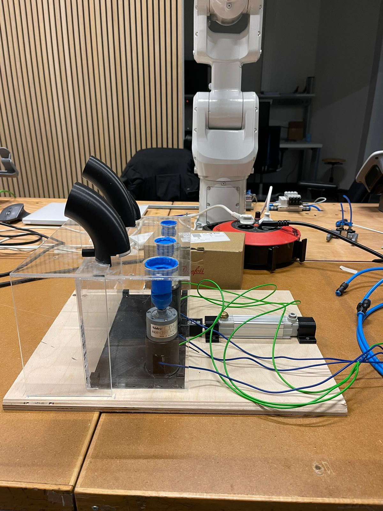
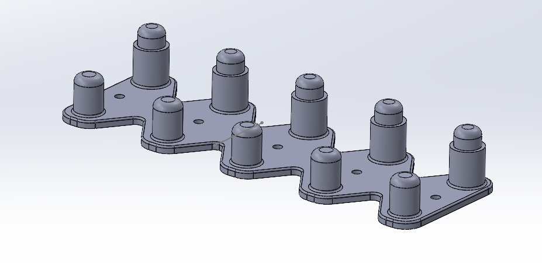

# Design overview

The setup consists of three motors with holders on top. In these, three of the different components can be placed. \
This is done automatically by pressing the entire container with a pneumatic cylinder. The pneumatic cylinder pushes the blue holders under the black storage tubes. \
Each of these black tubes contains five parts of the valve. When the cylinder pushes the blue holders under the black storage tubes, one of each part falls into the blue holder, and then the cylinder slides back. \
Next, the robot will pick up the two smaller parts from a storage plate (see image below) with a gripper and place them on the other parts in the blue holders. The robot will then pick up the base of the valve, the motors will start turning and by moving the base of the valve to the parts, they will be screwed on by the turning of the motor. \
\
In the files of the repository there is also a setupvideo.MOV file. This is a video that show the working of the loading system. \
\

