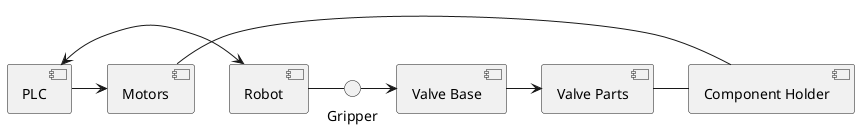

# Interface diagram

```plantuml
@startuml pickup_parcel_from_coveyor

    [Robot] as robot
    [PLC] as plc
    [Component Holder] as componentholder
    [Motors] as motors
    [Valve Base] as valvebase
    [Valve Parts] as valveparts

    interface "Gripper" as gripper
    
    robot - gripper
    gripper -> valvebase

    valveparts - componentholder
    motors - componentholder
    plc -> motors

    valvebase -> valveparts

    plc <-> robot


@enduml
```
