# Risk analysis

The risk analysis is based on the SICK Whitepaper provided by the company. This guideline indicates the risks of different componements like mechanical, electrical, operator and software. Possible adaptations due to an increased risk index will be discussed in the chapter future improvements. 

```plantuml
@startuml
object Risk_Analysis { 

    <#lightblue>|= Description: |= Cause: |= Effect: |= Severity: |= Exposure: |= Possibility of occurence: |= Avoidance: |= Risk index: |
    <#white>| |
    <#white>|= Mechanical | |
    <#white>| Collision between robot and operator | Collision between robot and operator  | Operator is slightly injured | S1 | E1 | O1 | A1 | <1 |
    <#white>| Malfunction of robot (jamming of robot&disconnected gripper after malfunctioning) | Collision between robot and operator  | Operator loses body parts due to collision | S3 | E1 | O1 | A1 | 3 |
    <#white>| Collision between robot and objects (not ment to be there) | Collision between robot and operator  | Operator dies due to collission  | S4 | E1 | O1 | A1 | 6 |
    <#white>| Robot cannot execute routine due to wrong proces (faulty sensors) | Collision between robot and objects  | Routine disruption by shifting position of work objects  | S1 | E1 | O1 | A1 | <1 |
    <#white>| Robot cannot execute routine due to lack of air pressure (pneumatic malfunction) | Collision between robot and objects  | Routine disruption by introducing foreign objects  | S1 | E1 | O1 | A1 | <1 |
    <#white>| Routine gets unexpectadly intererupted by operator (e.g. plugging in the wrong wires of downloading) | Pneumatic malfunction of robot  | Inabilty of robot to execute routine  | S2 | E1 | O1 | A1 | <1 |
    <#white>| Reduced robot performance (mechanical wear) | Schedules maintenace is not performed | Inabilty of robot to execute routine  | S1 | E1 | O1 | A1 | <1 |
    <#white>| Motor malfunction | Plugging in wires wrongly into robot setup | Interruption of robot routine / abrupt end  | S1 | E1 | O1 | A1 | <1 |
    <#white>| Positional inaccuracies from step loss of motor  | Stepper motor malfunction | Disruption in assembly process | S1 | E1 | O1 | A1 | <1 |
    <#white>| Positional inaccuracies from step loss of motor  | Stepper motor malfunction | Positional inacurracies from step loss | S1 | E1 | O1 | A1 | <1 |
    <#white>| Sensors won´t work properly | Faulty sensors  | Process disruption by inability to recognise componenets  | S1 | E1 | O1 | A1 | <1 |
    <#white>| Sensors won´t work properly | Faulty sensors  | Operator is harmed  by unintended mechanical  movemements | S2 | E1 | O1 | A1 | <1 |
    <#white>| Sensors won´t work properly | Malfunction of robot with sharp end effector  | Operator is stabbed  | S3 | E1 | O1 | A1 | 3 |
    <#white>|  |  |  |  |  |  |  |  |
    
    <#white>|= Electrical | |
    <#white>| Electrical shock (exposed wires) | Exposed wires  | Operator gets electrocuted   | S3 | E1 | O1 | A1 | 3 |
    <#white>| Short circuit (of wrongly connected wires) | Short circuit  | Electronic componenet destruction( sensors, actuators) | S1 | E1 | O1 | A1 | <1 |
    <#white>| Electromagnetic interference( from other electrical equipments around ) | Electrocmagnetic intereference  | Malfunction of electrical and electronic components  | S1 | E1 | O1 | A1 | <1 |
    <#white>| System failure ( voltage spikes or surges ) | Voltage spikes or surges  | Robot arm failure  | S1 | E1 | O1 | A1 | <1 |
    <#white>| Static electricity(component damage) | Static electricity  | Destruction to electronic componenets  | S1 | E1 | O1 | A1 | <1 |
    <#white>| Insulation issues  | Improper grounding of electrical outles  | Electrical fires causing damage to electrical / electronic devices  | S1 | E1 | O1 | A1 | <1 |
    <#white>| Electrical fires  | Short circuit  | Operator experiences skin burns  | S2 | E1 | O1 | A1 | <1 |
    <#white>| Deterioration in electrical wiring | Electrical wire insulation issues  | Electrical fires causing damage to electrical / electronic devices  | S1 | E1 | O1 | A1 | <1 |
    <#white>| Deterioration in electrical wiring | Electrical wire insulation issues  | Operator experiences skin burns  | S2 | E2 | O1 | A1 | 1 |
    <#white>| Deterioration in electrical wiring | Electrical wire insulation issues  | Operator gets electrocuted   | S3 | E1 | O1 | A1 | 3 |
    <#white>|  |  |  |  |  |  |  |  |

    <#white>|= User/Operator | |
    <#white>| Operator is not adequantly informed on how to operate the robot | Operator is not adequantly informed on  robot operation  | Operator is crushed by robot arm  | S4 | E1 | O1 | A1 | 6 |
    <#white>| Operator is not attentive to the robot proces | Inattentiveness of operator during robot operation | Operator is hit by robot arm  | S3 | E1 | O1 | A1 | 3 |
    <#white>| Human error in putting in commands   | Wrong input of operating commands  | Routine and process error  | S1 | E1 | O2 | A1 | <1 |
    <#white>| Negligence in following safety protocols  | Operator is not adequantly informed on safety precautions | Robot malfunction  | S1 | E0 | O1 | A1 | <1 |
    <#white>|  |  |  |  |  |  |  |  |

    <#white>|= Software | |
    <#white>| Malfunction and unintended movement (errors in robot control software) | Errors in robot control software  | Operator is hit  due to uncontrolled robot movement | S3 | E1 | O1 | A1 | 3 |
    <#white>| Software bugs  | Communication error between software and hardware | Malfunction of mechanical parts  | S1 | E0 | O1 | A1 | <1 |
    <#white>|  |  |  |  |  |  |  |  |

}  

    

@enduml
```

