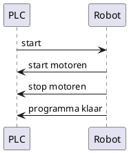

# Sequence diagram

```plantuml
@startuml bert_and_ernie

participant PLC as plc
participant Robot as robot

plc -> robot : start
robot -> plc : start motoren
robot -> plc : stop motoren
robot -> plc : programma klaar

@enduml
```
